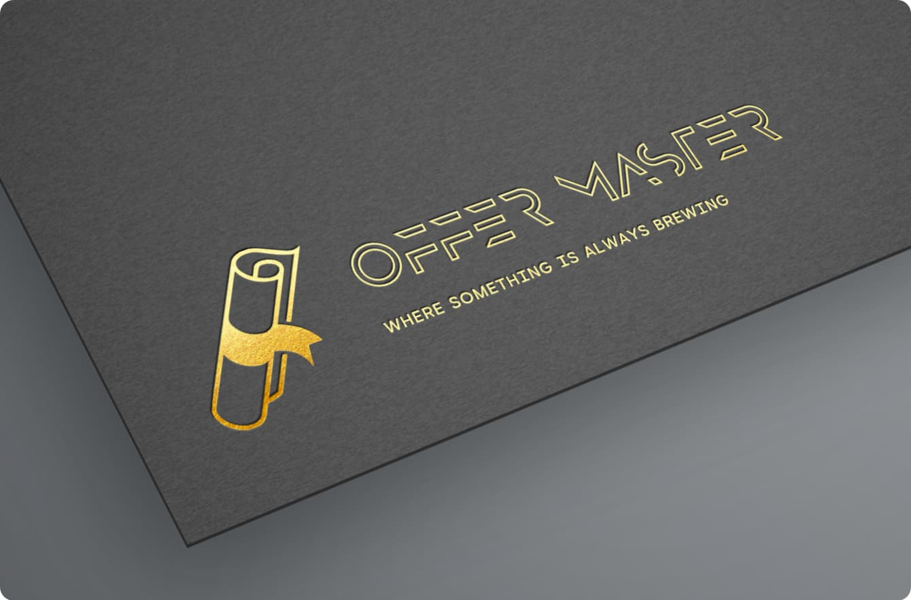

# COMP3032J-Degree-Project-Offer-Master-Group-7

View our project at: [http://ipa-008.ucd.ie/](http://ipa-008.ucd.ie/)


## Project Description
We aim to build web application with excellent user experience, high performance, and stability. Our potential users are who aim to apply to overseas universities. Our platform will help the users with school applications by providing them with one-stop application tools, such as program selection and admission community. Especially the program recommendation based on applicants' backgrounds is the key feature of our platform.



## Main Features
The **offer master** website provides the following main features:

* **Program and university recommendation**: Our website mainly focuses on helping applicants decide on schools and programs that best fit their backgrounds. Users can select their desired programs manually or access the programs recommended by our system. For a specific program selected by a user, the success rate of their admission will be analyzed.
* **Database of universities**: As our website aims at recommending schools and programs for our applicants, we also provide a database of universities. This database has several responsibilities. Firstly, the data will be used to train our recommendation models. Moreover, users can search and browse the data of schools and programs. Furthermore, users may leave comments for each program and select them into their own ``program list". The relevant data will be mainly collected in two ways. First, some open-source admission data and program information will be found on GitHub and Kaggle. Apart from that, our users can upload their own admission status and application backgrounds to expand our database.
* **Applicant background system**: We will provide a background system for our users (applicants) to support our recommendation system. Users can update their application backgrounds in this system, including their GPA, undergraduate school, language proficiency, and GRE score. Therefore, according to their uploaded background, our recommendation system is able to recommend appropriate schools and programs.
* **Applicants community**: To help our users to apply, an application community is also provided where our users can have a discussion with other applicants on topics of universities, programs, offers, etc. Moreover, they can post their admission information and check the offer timelines of recent years in this platform.

### Integrated Features

#### Spring Boot Admin

* URL: [http://localhost/springboot-admin](http://localhost/springboot-admin)


#### phpMyAdmin

* URL: [http://localhost/phpmyadmin/](http://localhost/phpmyadmin/)
* Username: root
* Password: offermaster


#### Portainer

* URL: [http://localhost/portainer/](http://localhost/portainer/)
* Username: admin
* Password: offermaster7


## Build this project

### Generate SSL certificate

```shell
docker-compose run --rm  certbot certonly --webroot --webroot-path /var/www/certbot/ -d ipa-008.ucd.ie
```

### Using docker-compose
Create an `docker-compose.yml`
```shell
docker-compose pull && docker-compose up -d --no-build --remove-orphans
```

```yaml
version: '3'

services:

  # Proxies requests to internal services
  reverse-proxy:
    image: nginx:1.20.2
    container_name: fyp_offer_master_reverse_proxy
    depends_on:
      - fyp_offer_master_springboot_admin
      - fyp_offer_master_springboot
      - fyp_offer_master_vue_user
      - fyp_offer_master_vue_admin
      - fyp_offer_master_portainer
    volumes:
      - ./nginx-reverse-proxy/nginx.conf:/etc/nginx/nginx.conf
    ports:
      - 80:80
    networks:
      - offer_master_network

  fyp_offer_master_springboot_admin:
    image: echocool/fyp_offer_master_springboot_admin:${VERSION:-latest}
    container_name: fyp_offer_master_springboot_admin
    expose:
      - "8081"
    networks:
      - offer_master_network
    restart: on-failure

  # springboot backend
  fyp_offer_master_springboot:
    image: echocool/fyp_offer_master_springboot:${VERSION:-latest}
    container_name: fyp_offer_master_springboot
    build:
      context: ./springboot-offer-master
    depends_on:
        fyp_offer_master_db:
          condition: service_healthy
    environment:
      - SERVER_ADDRESS=fyp_offer_master_springboot
      - DB_URL=jdbc:mysql://fyp_offer_master_db:3306/offermaster
      - DB_USERNAME=root
      - DB_PASSWORD=offermaster
      - DB_DRIVER=com.mysql.cj.jdbc.Driver
    expose:
      - "8080"
    networks:
      - offer_master_network
    restart: on-failure


  # user portal
  fyp_offer_master_vue_user:
    image: echocool/fyp_offer_master_vue_user:${VERSION:-latest}
    container_name: fyp_offer_master_vue_user
    build:
      context: ./vue-user
    depends_on:
      - fyp_offer_master_springboot
    expose:
      - "8080"
    networks:
      - offer_master_network
    restart: on-failure


  # admin portal
  fyp_offer_master_vue_admin:
    image: echocool/fyp_offer_master_vue_admin:${VERSION:-latest}
    container_name: fyp_offer_master_vue_admin
    build:
      context: ./vue-admin
    depends_on:
      - fyp_offer_master_springboot
    expose:
      - "8080"
    networks:
      - offer_master_network
    restart: on-failure

  fyp_offer_master_django_ml:
    image: echocool/fyp_offer_master_django_ml:${VERSION:-latest}
    container_name: fyp_offer_master_django_ml
    build:
      context: ./django_ml
    depends_on:
      - fyp_offer_master_springboot
    expose:
      - "8080"
    networks:
      - offer_master_network
    restart: on-failure

#  fyp_offer_master_minio:
#    image: echocool/fyp_offer_master_minio
#    ports:
#      - "9000:9000"
#      - "9090:9090"
#    networks:
#      - offer_master_network
#    volumes:
#      - ~/.fyp_offer_master/minio/data:/data
#    environment:
#      MINIO_ROOT_USER: group7
#      MINIO_ROOT_PASSWORD: group7group7
#    command: server /data --console-address ":9090"

  fyp_offer_master_portainer:
    image: portainer/portainer-ce
    restart: always
    ports:
      - "8800:8000"
      - "9900:9000"
    labels:
      - "traefik.enable=true"
      - "traefik.http.routers.whoami.rule=Host(`ipa-008.ucd.ie`) && PathPrefix(`/portainer`)"
      - "traefik.http.middlewares.portainer-stripprefix.stripprefix.prefixes=/portainer"
      - "traefik.http.routers.whoami.middlewares=portainer-stripprefix@docker"
      - "traefik.http.routers.whoami.entrypoints=web-secure"
      - "traefik.http.routers.whoami.tls=false"
      - "traefik.http.services.whoami.loadbalancer.server.scheme=http"
      - "traefik.http.services.whoami.loadbalancer.server.port=9000"
    networks:
      - offer_master_network
    volumes:
      - /var/run/docker.sock:/var/run/docker.sock
      - ~/.fyp_offer_master/portainer/data:/data
  fyp_offer_master_db:
    image: mysql:8.0
    restart: always
    environment:
      - MYSQL_DATABASE=offermaster
      - MYSQL_ROOT_PASSWORD=offermaster
    expose:
      - "3306"
    healthcheck:
      test: [ "CMD", "mysqladmin" ,"ping", "-h", "localhost" ]
      timeout: 2s
      retries: 100
    networks:
      - offer_master_network
    volumes:
      - ~/.fyp_offer_master/db:/var/lib/mysql

  fyp_offer_master_phpmyadmin:
    image: phpmyadmin/phpmyadmin
    container_name: fyp_offer_master_phpmyadmin
    environment:
      PMA_HOST: fyp_offer_master_db
      PMA_PORT: 3306
      PMA_ARBITRARY: 1
      PMA_ABSOLUTE_URI: http://ipa-008.ucd.ie/phpmyadmin
    restart: always
    networks:
      - offer_master_network
    ports:
      - "8088:80"

networks:
  offer_master_network:

```

```shell
docker-compose build --parallel
```
or
```shell
docker-compose up -d --build
```

```shell
docker-compose up
```

### Backend (Springboot)
```bash
mvn package -DskipTests --file pom.xml
docker build -t fyp_offer_master_springboot .
docker build . --file Dockerfile --tag ghcr.io/echo-cool/fyp/fyp_offer_master_springboot:latest
```

### Frontend-User (Vue)
```bash
cd vue-user/
npm install
npm run build
docker build -t fyp_offer_master_vue_user .
```

### Frontend-Admin (Vue)
```bash
cd vue-admin/
npm install
npm run build:prod
docker build -t fyp_offer_master_vue_admin .
```
## Starting this project

### Backend (Springboot)
```bash
docker pull ghcr.io/echo-cool/fyp/fyp_offer_master_springboot:latest
docker run -p 8080:8080 ghcr.io/echo-cool/fyp/fyp_offer_master_springboot:latest
```

### Frontend-User (Vue)
```bash
docker pull ghcr.io/echo-cool/fyp/fyp_offer_master_vue_user:latest
docker run -p 8081:8080 ghcr.io/echo-cool/fyp/fyp_offer_master_vue_user:latest
```

### Frontend-Admin (Vue)
```bash
docker pull ghcr.io/echo-cool/fyp/fyp_offer_master_vue_admin:latest
docker run -p 8082:8080 ghcr.io/echo-cool/fyp/fyp_offer_master_vue_admin:latest
```